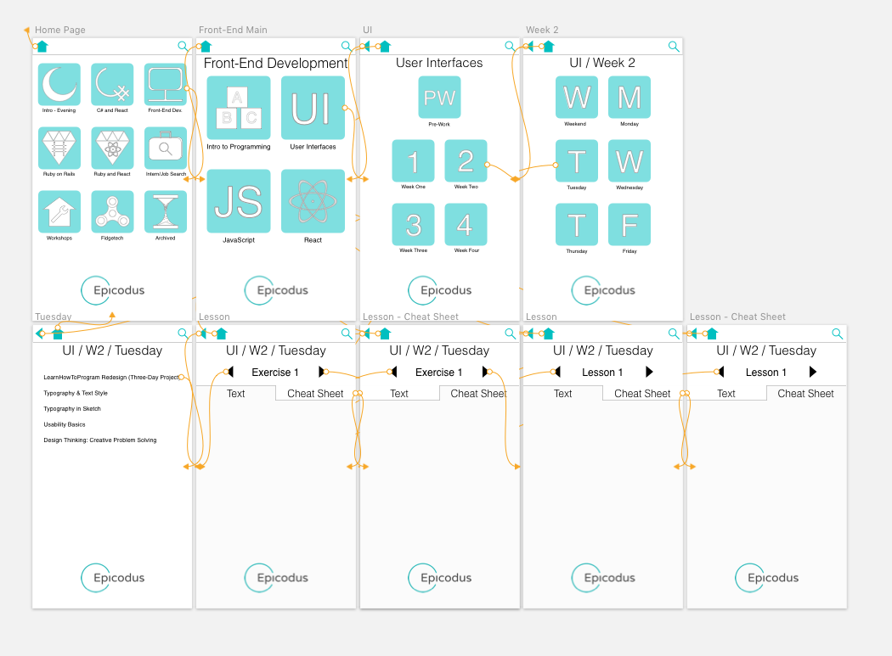
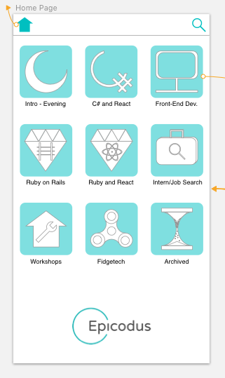
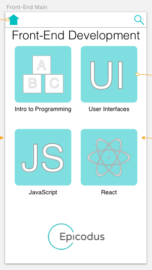
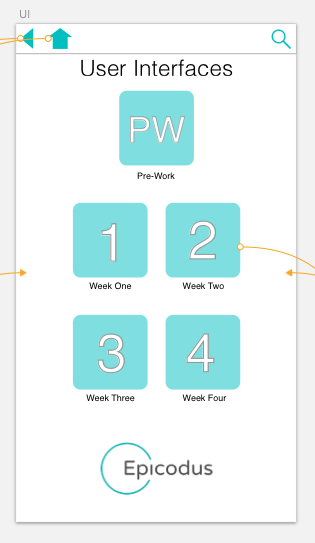
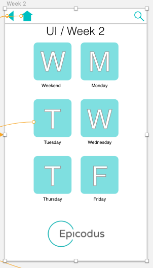
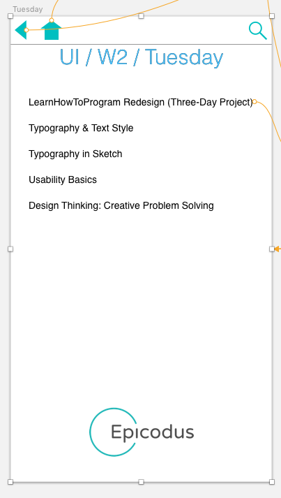
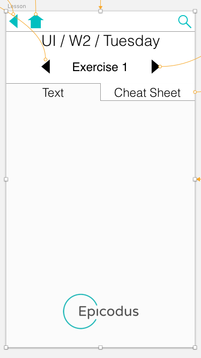
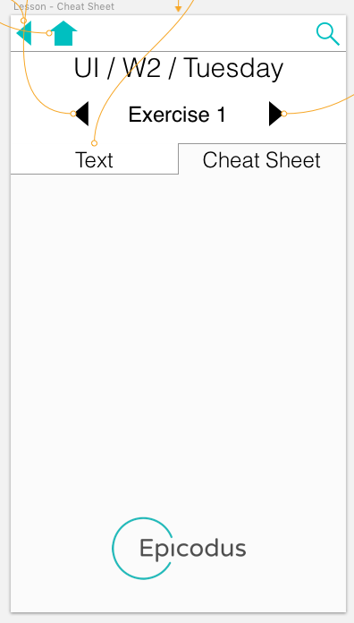
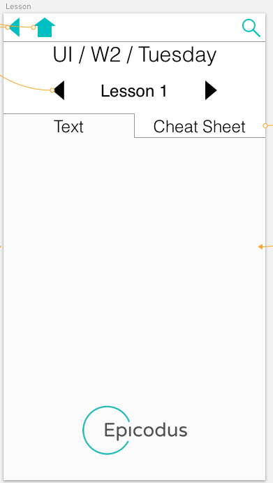
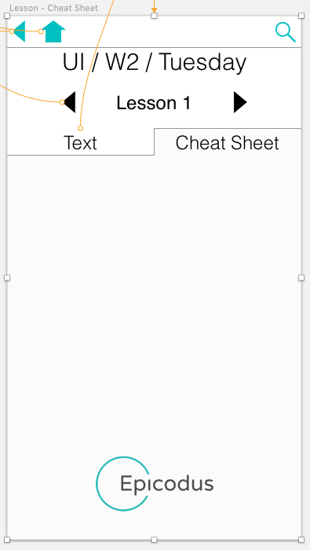

# Website Remodel

## Remodeling of learnhowtoprogram.com

**By Travis Toal and Nayomi Morita**

# Description
* _User-driven reimagining of a service-providing webpage._

## User Stories
* _Darnell was an eight year old prodigy until the Ukrainian mafia attacked him. Now his Nana has to save the day and LEARN TO PROGRAM!!!However the website was too difficult to use, so Darnell died since Nana couldn't pay the mafia. 1 like = 1 respect._

* __

* _Bob was recently divorced. His wife left for a man who could code. In an attempt to reignite his masculine fire he decided to enroll in epicodus. However the inconvenient layout proved too difficult to navigate and Bob wasn't able to afford Karyyn, and she got the kids. Like if you literally cried._

* __

* _Roberto was down on his luck. No girl no future no respect. Then he learned sketch and he's running things lv.100 mafia boss style. He gave a loan to Nana and since the learn to program site was so ungodly he ignored the lessons on micro-aggressions. He became evil and killed Darnell as collateral._

* __

## Specs

